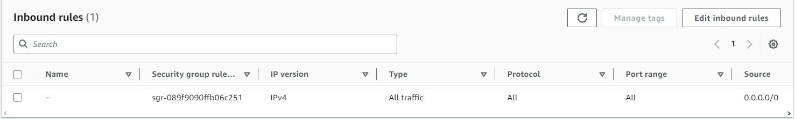
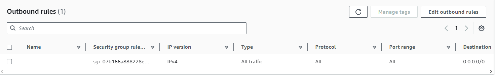
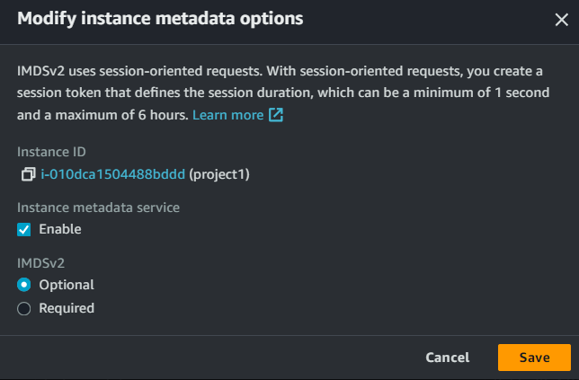
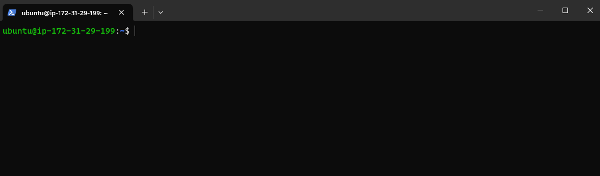

# Project-1

## IMPORTANT: This will be done using free tier account, so there will be no charges as long as you use the free tier services.

### This project outlines the setup and basic structure of a web project using the LAMP stack (Linux, Apache, MySQL, PHP) on an Ubuntu Server.

## Preparing Prerequisites 

### Log into your AWS account and create a Security Group which you will allow all inbound traffic 

### Start an EC2 instance and run Ubuntu OS, chose the t2.micro instance type, create a key pair that you will save on your local machine, you will use that to connect to the instance and chose the Security group you just created. You are all set now and you can launch the instance.

### In order to have access to the metadata from your terminal, follow the next steps:

1. Select your instance.
2. Follow the path: Actions-> Instance settings-> Modify instance metadata options
3. IMDSv2-> Optional

### Open the terminal on your local machine and connect to the instance by copying the following 

### You should see the following: 

## You are ready to go to the next Step.