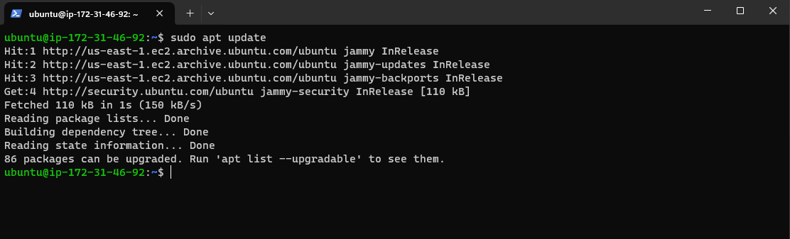
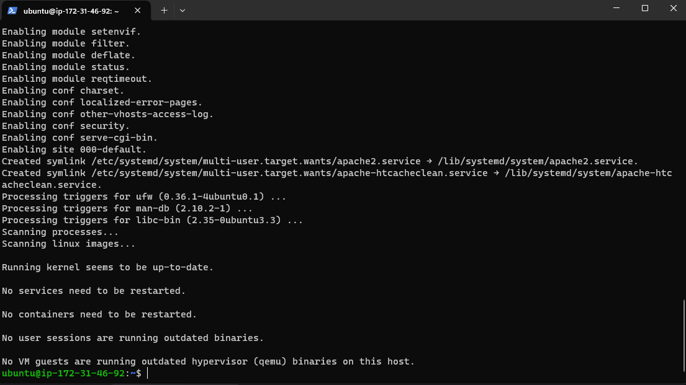
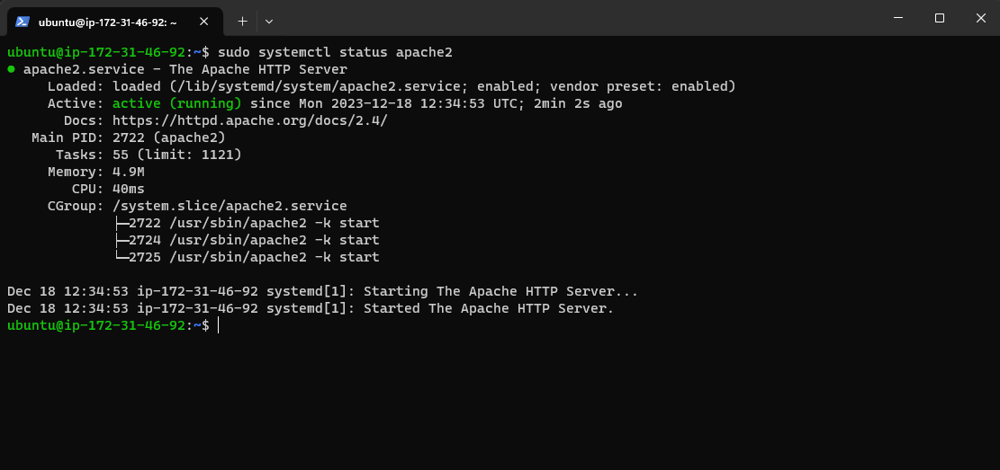
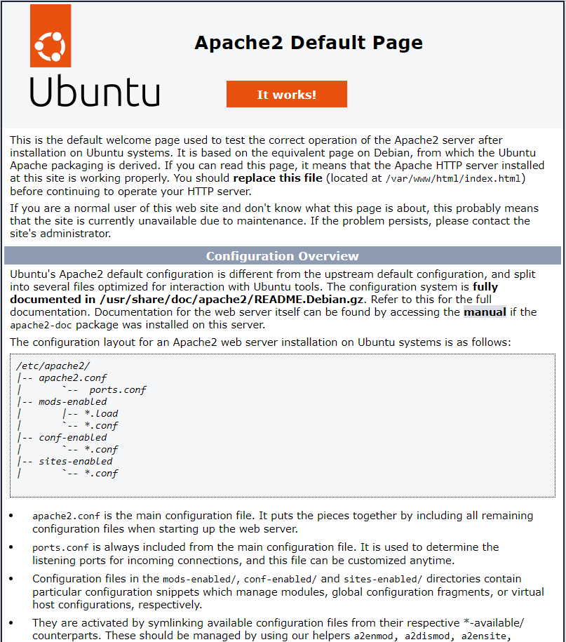

## STEP 1 — INSTALLING APACHE AND UPDATING THE FIREWALL

### 1.1: Open the terminal and update the package list:

`sudo apt update`

### 1.2: Install Apache

`sudo apt install apache2`

### When prompted, confirm installation by typing Y, and then ENTER.

### 1.3: To verify that apache2 is running as a Service in our OS, use following command:

`sudo systemctl status apache2`

### If it is green and running, then you did everything correctly – you have just launched your first Web Server in the Clouds!

### 1.4: Enable Apache to start on boot:

`sudo systemctl enable apache2`

### 1.5: Start the Apache service

`sudo systemctl start apache2`

### Now it is time for us to test how our Apache HTTP server can respond to requests from the Internet. Open a web browser of your choice and try to access following url

`http://<Public-IP-Address>:80`   replace the <Public-IP-Address> with the public IPv4 from the ubuntu server

### Another way to retrieve your Public IP address, other than to check it in AWS Web console, is to use following command:

`curl -s http://169.254.169.254/latest/meta-data/public-ipv4`

### If you see following page, then your web server is now correctly installed and accessible through your firewall.

