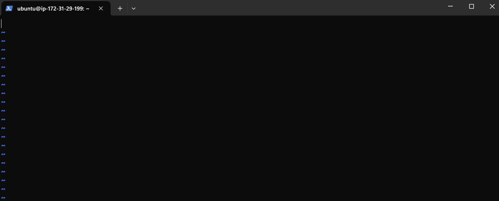
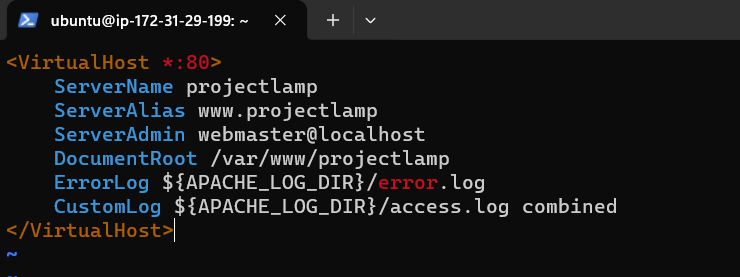
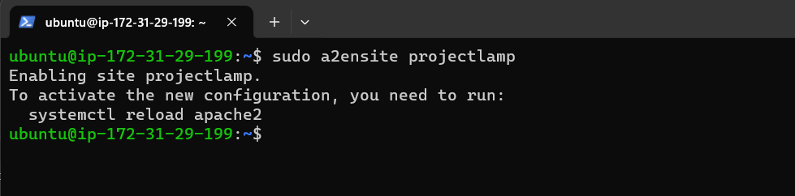

## STEP 4 — CREATING A VIRTUAL HOST FOR YOUR WEBSITE USING APACHE

### 4.1: Create project directory: 

`sudo mkdir /var/www/projectlamp`

### 4.2: Set ownership of the directory with your current system user:

`sudo chown -R $USER:$USER /var/www/projectlamp`

### 4.3: Create and open a new configuration file in Apache’s sites-available directory using your preferred command-line editor. Here, we’ll be using vi or vim (They are the same by the way):

`sudo vi /etc/apache2/sites-available/projectlamp.conf`

### Inside the opened file, press "I" on the keyboard and paste the following: 

- `<VirtualHost *:80>`
    - `ServerName projectlamp`
    - `ServerAlias www.projectlamp`
    - `ServerAdmin webmaster@localhost`
    - `DocumentRoot /var/www/projectlamp`
    - `ErrorLog ${APACHE_LOG_DIR}/error.log`
    - `CustomLog ${APACHE_LOG_DIR}/access.log combined`
- `</VirtualHost>`

### !!!!!!!!  Make sure the text looks like this in the terminal

### 4.4: Save the file by following the next steps:

    1. Press "ESC" on the keyboard
    2. Type ":wq" for write and quit
    3. Hit "Enter"

### 4.5: You can use the ls command to show the new file in the sites-available directory

`sudo ls /etc/apache2/sites-available`

### 4.6: Enable the virtual host:

`sudo a2ensite projectlamp`

### 4.7: Disable default website 

`sudo a2dissite 000-default`

### 4.8: Check configuration syntax:

`sudo apache2ctl configtest`

## Output:  Syntax OK

### 4.8: Reload Apache:

`sudo systemctl reload apache2`

### 4.9: Create a Text HTML file: 

`sudo sh -c "echo 'Hello LAMP from hostname' $(curl -s http://169.254.169.254/latest/meta-data/public-hostname) 'with public IP' $(curl -s http://169.254.169.254/latest/meta-data/public-ipv4) > /var/www/projectlamp/index.html" `

### Now go to your browser and refresh the page:

## You can now go to the next Step.