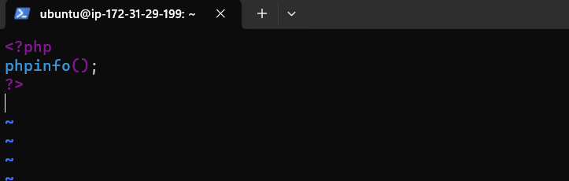
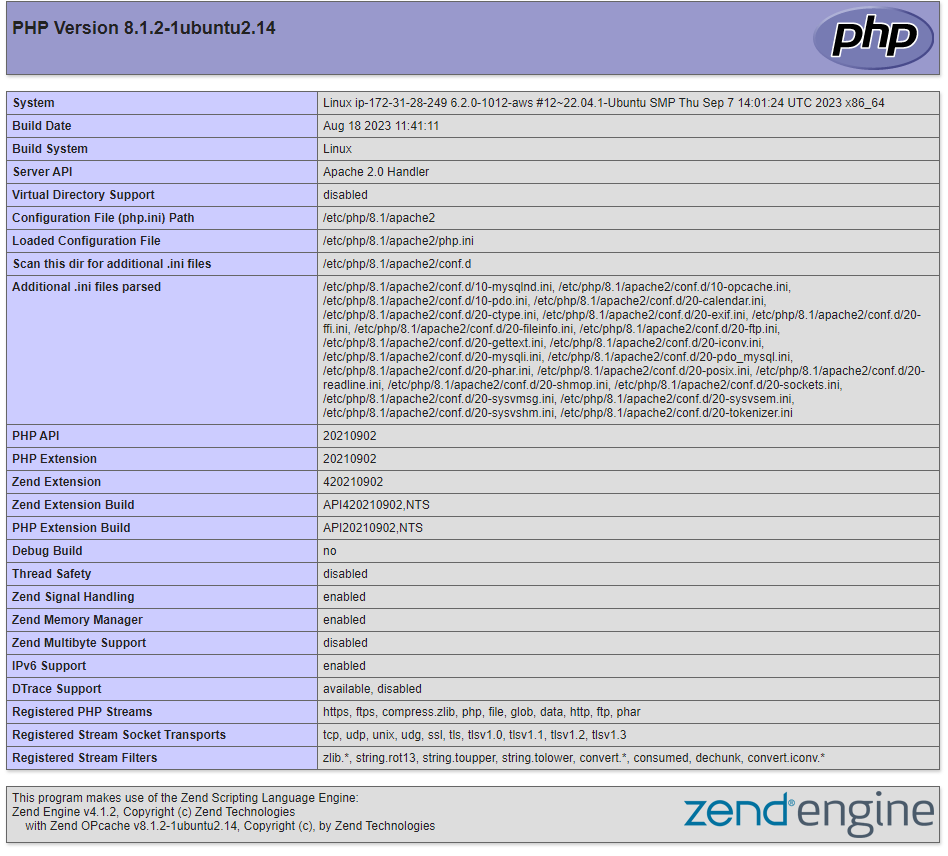

## Step 5 - ENABLE PHP ON THE WEBSITE

### 5.1: Modify `dir.conf` File

`sudo vim /etc/apache2/mods-enabled/dir.conf`

### Update the order in `DirectoryIndex`

#### `DirectoryIndex index.php index.html index.cgi index.pl index.xhtml index.htm`

### Save and exit. 

    1. Press "ESC" on the keyboard
    2. Type ":wq" for write and quit
    3. Hit "Enter"

### 5.2: Reload Apache: 

`sudo systemctl reload apache2`

### 5.3: Create PHP Test Script:

`vim /var/www/projectlamp/index.php`

#### Inside the file, add the following PHP code: 

#### `-<?php`
#### `-phpinfo();`
#### `-?>`

### Save and exit. (If not sure how, check the step 5.1)

### !!! IT SHOULD LOOK LIKE THIS !!!

### 5.4: Refresh the URL with the Apache website 

### This page provides information about your server from the perspective of PHP. It is useful for debugging and to ensure that your settings are being applied correctly.

### If you can see this page in your browser, then your PHP installation is working as expected.

### After checking the relevant information about your PHP server through that page, it’s best to remove the file you created as it contains sensitive information about your PHP environment -and your Ubuntu server. You can use rm to do so:

`sudo rm /var/www/projectlamp/index.php`

## Congratulations! You have finished a REAL LIFE PROJECT by deploying a LAMP stack website in AWS Cloud!