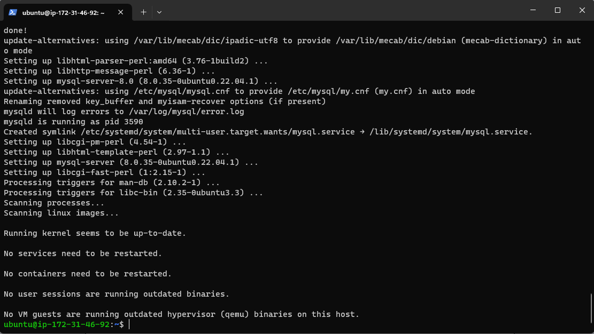
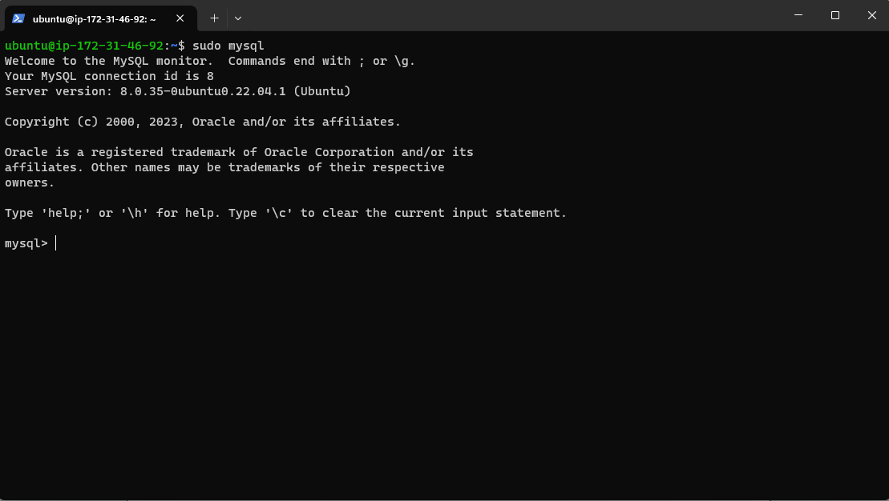
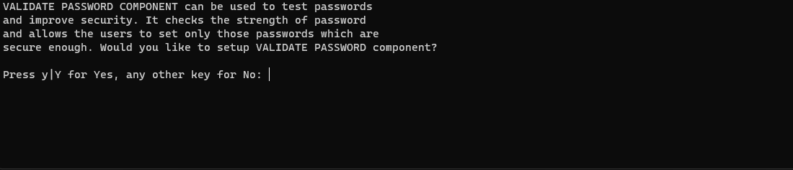
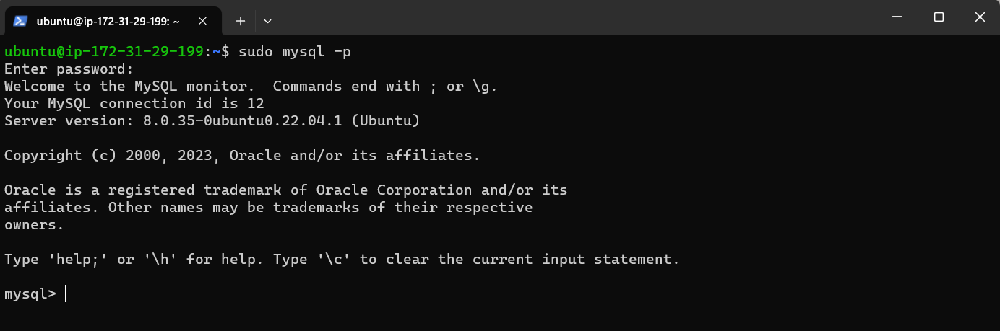

## STEP 2 — INSTALLING MYSQL

### Now that you have a web server up and running, you need to install a Database Management System (DBMS) to be able to store and manage data for your site in a relational database. MySQL is a popular relational database management system used within PHP environments, so we will use it in our project.

### 2.1: Again, use ‘apt’ to acquire and install this software:

`$ sudo apt install mysql-server`

### When prompted, confirm installation by typing Y, and then ENTER.

### 2.2: When the installation is finished, log in to the MySQL console by typing:

`$ sudo mysql`

### 2.3: It’s recommended that you run a security script that comes pre-installed with MySQL. This script will remove some insecure default settings and lock down access to your database system. Before running the script you will set a password for the root user, using mysql_native_password as default authentication method. We’re defining this user’s password as PassWord.1.

`ALTER USER 'root'@'localhost' IDENTIFIED WITH mysql_native_password BY 'PassWord.1';` 

### Exit the MySQL shell with: 

`mysql> exit`

### 2.4: Start the interactive script by running:

`$ sudo mysql_secure_installation`

### This will ask if you want to configure the VALIDATE PASSWORD PLUGIN.

### Note: Enabling this feature is something of a judgment call. If enabled, passwords which don’t match the specified criteria will be rejected by MySQL with an error. It is safe to leave validation disabled, but you should always use strong, unique passwords for database credentials.

### 2.5: Answer Y for yes, or anything else to continue without enabling.

### 2.6: If you answer “yes”, you’ll be asked to select a level of password validation. Keep in mind that if you enter 2 for the strongest level, you will receive errors when attempting to set any password which does not contain numbers, upper and lowercase letters, and special characters, or which is based on common dictionary words e.g PassWord.1.

### Regardless of whether you chose to set up the VALIDATE PASSWORD PLUGIN, your server will next ask you to select and confirm a password for the MySQL root user. This is not to be confused with the system root. The database root user is an administrative user with full privileges over the database system. Even though the default authentication method for the MySQL root user dispenses the use of a password, even when one is set, you should define a strong password here as an additional safety measure. We’ll talk about this in a moment.

### If you enabled password validation, you’ll be shown the password strength for the root password you just entered and your server will ask if you want to continue with that password. If you are happy with your current password, enter Y for “yes” at the prompt:

### For the rest of the questions, press Y and hit the ENTER key at each prompt. This will prompt you to change the root password, remove some anonymous users and the test database, disable remote root logins, and load these new rules so that MySQL immediately respects the changes you have made.

### 2.7: When you’re finished, test if you’re able to log in to the MySQL console by typing:

`$ sudo mysql -p`

### Notice the -p flag in this command, which will prompt you for the password used after changing the root user password.

### 2.8: To exit the MYSQL console, type:

`mysql> exit`

### Notice that you need to provide a password to connect as the root user.

### For increased security, it’s best to have dedicated user accounts with less expansive privileges set up for every database, especially if you plan on having multiple databases hosted on your server.

### Your MySQL server is now installed and secured. Next, we will install PHP, the final component in the LAMP stack.