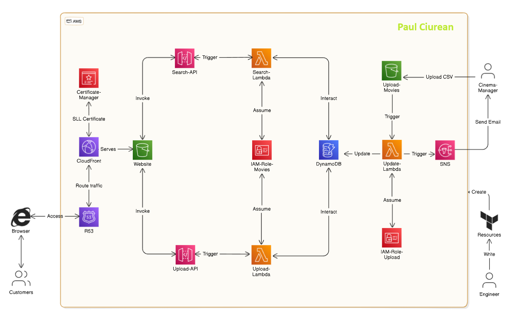

# Cinema Groot: Real-Time Movies Availability App

## **Project Description:**

### Cinema Groot is a powerful and scalable web application built to provide real-time movie availability and detailed information for cinema-goers. The frontend of the application allows users to view available movies at the top of the page and search for specific movies to check their availability in cinemas. Each search returns comprehensive movie details, including ratings, release year, descriptions, and showtimes.

## **Backend Architecture:**

- **Amazon S3:** Two S3 buckets are utilized—one for backend storage, where managers upload a CSV file with movie details, and another to host the static frontend website.

- **AWS Lambda:** Lambda functions power the backend operations. When a CSV file is uploaded to S3, it triggers a Lambda function that processes the file and updates the DynamoDB table with movie details. This Lambda also triggers an SNS notification to inform the manager of the update. Another Lambda function retrieves movie data from DynamoDB when users search for specific titles, while a third Lambda fetches movie titles for display at the top of the website.

- **Amazon API Gateway:** API Gateway acts as the front door for the application, triggering the Lambda functions that retrieve data from DynamoDB and serve it to the frontend. This ensures a secure and scalable API interface for users.

- **Amazon DynamoDB:** DynamoDB is used as the NoSQL database to store and manage movie details. The table is updated dynamically based on the CSV input, with the movie title as the primary key.

- **Amazon CloudFront:** CloudFront is used as the content delivery network (CDN) to distribute the static website hosted in S3. This ensures low latency and high performance for users around the globe.

- **AWS IAM (Identity and Access Management):** IAM is used to securely manage permissions for the Lambda functions, ensuring they have the appropriate access to other AWS services like DynamoDB, S3, and SNS.

- **Amazon SNS:** SNS (Simple Notification Service) sends notifications to the manager when the DynamoDB table is successfully updated.

- **Amazon Route 53 and AWS Certificate Manager:** Route 53 handles DNS management, while Certificate Manager provides SSL certificates for securing the domain name used for the application.

- **Terraform:** The entire infrastructure is deployed and managed using Terraform, allowing for Infrastructure as Code (IaC) and enabling seamless scalability and consistency across environments.

## **Key Features:**

1. **Scalability:** The serverless architecture, powered by AWS Lambda, API Gateway, and DynamoDB, ensures that the application can scale effortlessly with increased user demand. CloudFront enhances scalability by distributing content globally.

2. **Security:** IAM roles and policies tightly control access to resources, ensuring that only authorized Lambda functions and services can access the necessary AWS components. SSL certificates from AWS Certificate Manager encrypt data, ensuring secure communication between users and the application.

3. **Reliability:** Leveraging AWS services such as Lambda, DynamoDB, and CloudFront, the app is designed for high availability and minimal downtime. SNS ensures that managers stay informed about backend operations, further enhancing reliability.

4. **Performance:** CloudFront's global CDN ensures that the website loads quickly, regardless of the user's location, while API Gateway and Lambda provide efficient data retrieval from DynamoDB.

## **Conclusion:**

### Cinema Groot is a comprehensive, cloud-native application that simplifies the process of checking movie availability in cinemas. Built with a focus on scalability, security, and performance, the app is well-equipped to handle growing user demands and can be expanded with additional features as needed. Its use of modern AWS services ensures a reliable and secure user experience, making it an ideal solution for real-time movie information delivery.