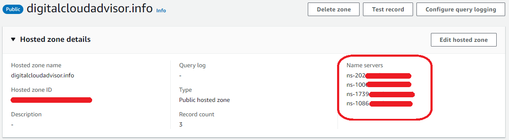
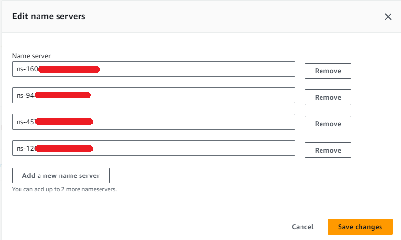
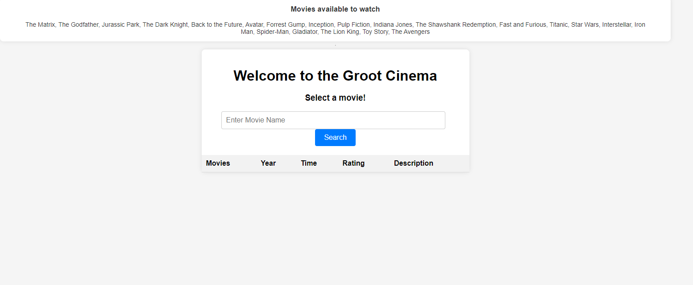

# Welcome 

## Below you can find the guide that will walk you through the process of building this app.

### In the `Terraform-config` folder, you will find all the `.tf` files needed to build this app. Additionally, there are 3 `.zip` files containing the Python code for the Lambda functions.

## Prerequisites:

- A Domain Name
- Basic experience using Terraform
- Basic experience navigating the AWS Console

## 1. Create a folder on your local machine and store all the files from `Terraform-config` in it.

## 2. Open the folder in your favorite IDE and run the Terraform commands.

## 3. Enter all the required variables when prompted. (You will need to provide the account number because the IAM policy requires it to create the policy and IAM roles).

## 4. After confirming with "Yes," go to the AWS Console and navigate to Route 53.

## 5. In Route 53, click on `Hosted Zones`, `Domain Name` and click on `Hosted zone details`.

## 6. In another tab, open `Registered Domains`, click on your domain, and under `Details`, click on `Actions` -> `Edit Name Servers`.

## 7. From the `Domain Name` page, copy all the `Name Servers` listed under `Hosted Zone Details` to the `Edit Name Servers` section.

### The reason for this is that, in order for the Certificate Manager to issue a certificate, the `Name Servers` from the Hosted Zone must match those from `Registered Domains`.

## 8. Once everything is set up, upload the files from the `FrontEnd` folder to the `Website Bucket`.

### The website should now be working, and you can access it using your domain name. Alternatively, you can access it through the CloudFront distribution.

### PS: Sometimes it takes 48 hours for the changes from `name servers` to propagate and you might not be able to access the website from your domain name.

## 9. Once the website is up and running, upload a CSV file (you can use `movies-test-csv.csv` as a sample) to the `Upload Bucket`, then return to the website and refresh it.

## The website should look like this:

### PS: In case you have any questions, feel free to PM me on LinkedIn.

# Enjoy the movie! 😁