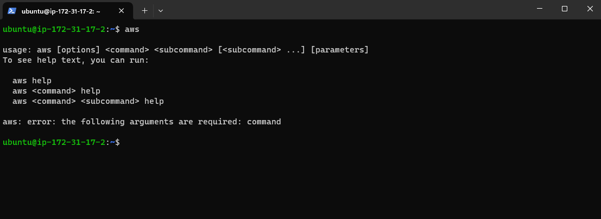
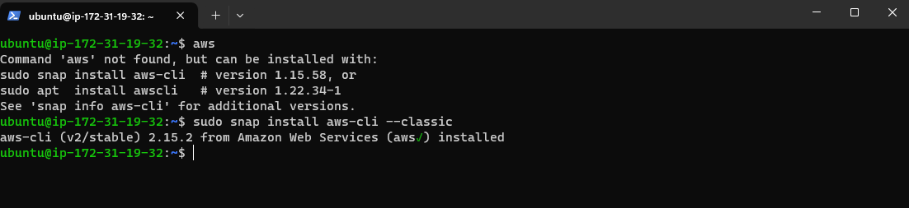
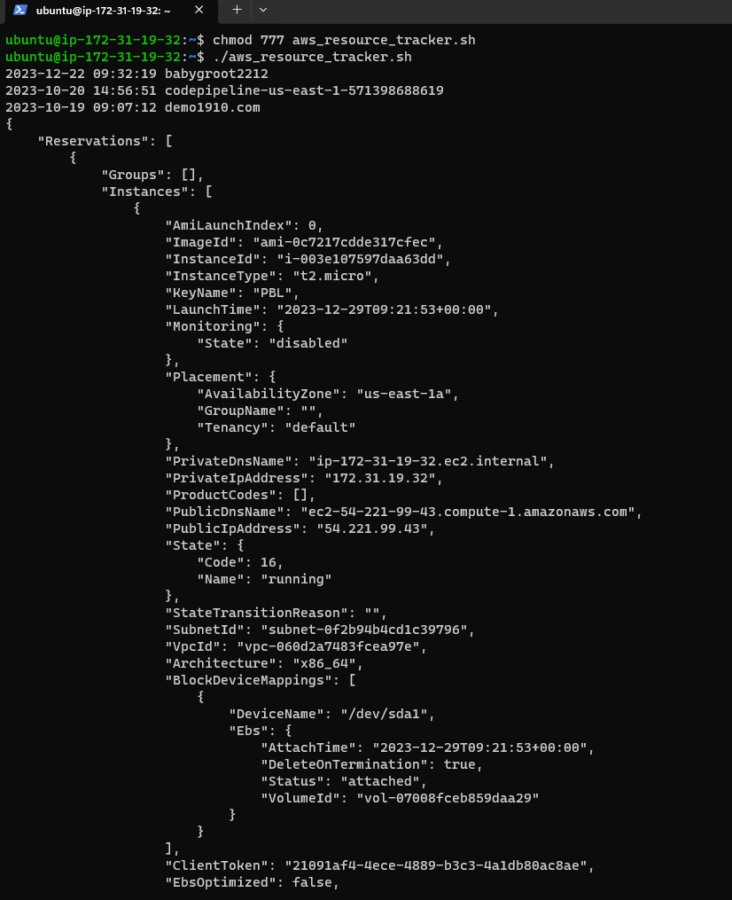
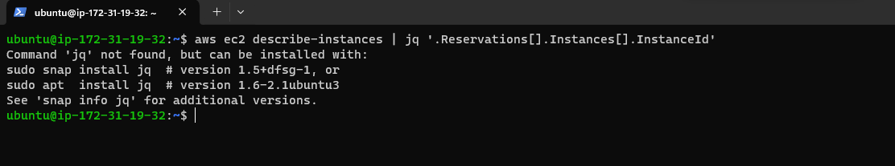
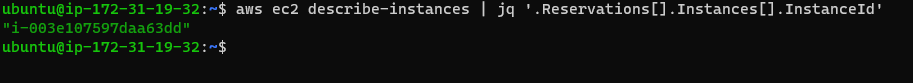
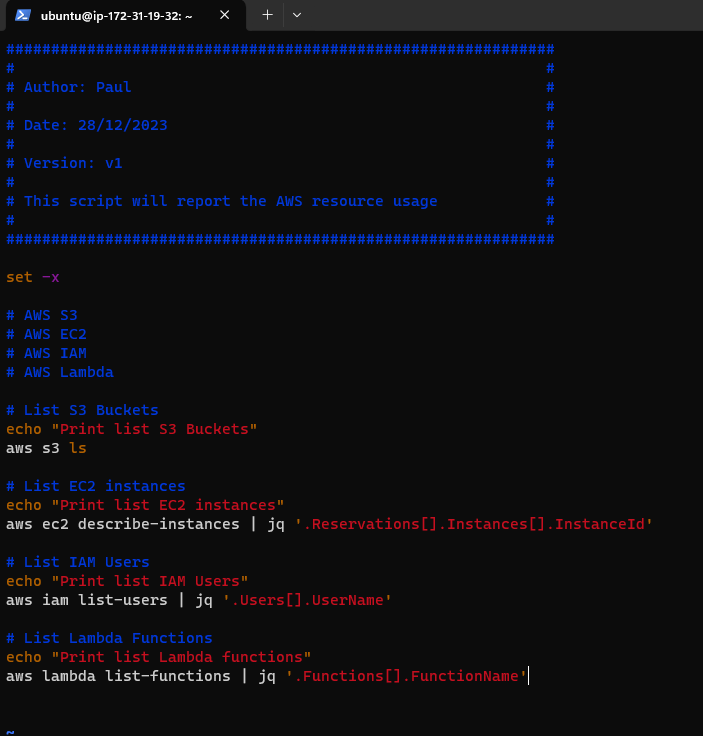
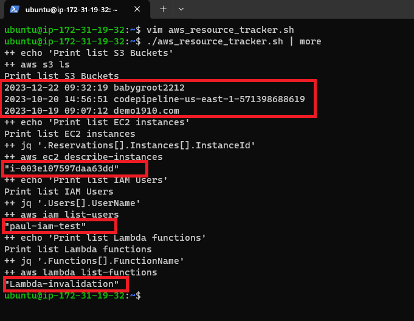
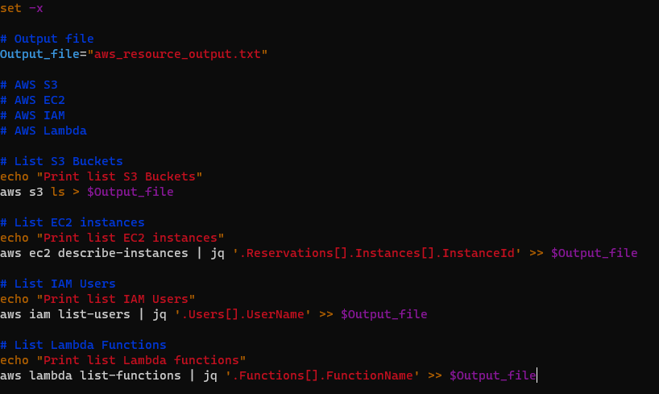
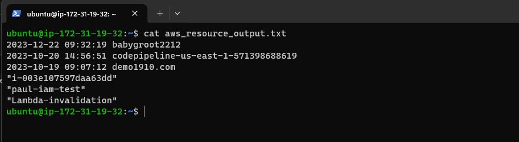

# DevOps-Project-2

# Create a Monitoring APP using Shell scripts

### Create an APP using Shell scripts to monitor the EC2, S3, Lambda and IAM Users of an account.

### Use case: Check how many EC2, S3, Lambda and IAM Users are in the account.

## Step 1:

### 1.1: Launch an EC2 instance running Ubuntu.

### 1.2: Connect to the EC2 instance from your local machine, and make sure that you have the AWS CLI installed.

### !!! In case you don't have it installed, run the following: 

` sudo snap install aws-cli --classic `

### 1.3: Configure the credentials to communicate with AWS:

`aws configure`

### !!! Make sure you fill all the details in. If you do not already have credentials file, you can create it from AWS console from the "Security credentials" section from the top right-hand side where your profile is. !!!

## Step 2: Create a script file.

### 2.1: Run:

`vim aws_resource_tracker.sh`

### Expected output:

### 2.2: Edit the file by pressing " i " on keyboard to change to the "insert mode".

### 2.3: Type the first command:

` #!/bin/bash`

### 2.4: Write about the script:

### !!!  You start off by giving some details about who created the script, when, what version( in case you want to do updates) and what the script does. !!!

### !!! Always try to give a description about what the command does. e.g: # List s3 buckets for  "aws s3 ls"  so people who are new using the services will know what the commands do.

### To find a list with all the commands for the script visit:

[aws cli commands](https://docs.aws.amazon.com/cli/latest/reference/)

### 2.5: Save and quit to see how the script works. 

1. Press " ESC " 
2. Press " Shift+: "
3. Type " wq! "  
4. Press " Enter "

### Step 3: We now check how the script works by doing the following.

### 3.1: Run: 

` chmod 777 aws_resource_tracker.sh`

### This is giving the permissions, not the best practice to use "777" but for the purpose of the demo we are all right.

### 3.2: Run:

` ./aws_resource_tracker.sh `

### You should see the following: 

### PS: Press Q to exit once you get to the bottom.

### 3.3: To read the output easier run:

` ./aws_resource_tracker.sh | more `

### It should be a long list if you have functions, ec2's and many others because it gives you full details about everything you asked for.

### At the moment, it is hard to read the output, so let's simplify things a bit.

### Step 4: We modify the script so we will be able to read the output easier.

### 4.1: Open the file by running:

` vim aws_resource_tracker.sh `

### 4.2: Press " i " on the keyboard to be able to Insert text.

### 4.3: We add print statements so the user gets debugged informations:

### Just above each script type the following:

` echo "Print list of S3 Buckets" `

` echo "Print list of EC2" `

` echo "Print list of IAM Users" `

` echo "Print list of Lambda functions" `

### We also put the script into debug mode with:

` set -x `

### 4.4: We want to list the instances, we don't want the full details of them, in order to do that, we can run:

` aws ec2 describe-instances | jq '.Reservations[].Instances[].InstanceId' `

#### What we have done here is, with " | " we send the output of the instance to " jq ". JQ is a tool that enable us to extract, manipulate, and transform JSON data with ease. The rest of the script is just the path which takes us to the results we expect. 

### !!! If you get the following results: 

### Type the following command: 

` sudo snap install jq `

### If you run the ` aws ec2 describe-instances | jq '.Reservations[].Instances[].InstanceId' ` again you should see the following:

### 4.5: At the moment, the script lists the S3 buckets, so we don't have to modify anything there, but we modify all the rest with the following:

` aws ec2 describe-instances | jq '.Reservations[].Instances[].InstanceId'    `

` aws iam list-users | jq '.Users[].UserName'    `

` aws lambda list-functions | jq '.Functions[].FunctionName'  `

### Your script should look like this:

### Run the following again ` ./aws_resource_tracker.sh | more ` expected output:

### Highlighted in red you will see the details you run the script for. This script can be expanded for any resources you want from your AWS account. 

### Step 5: To make things even easier, we can create a file and store the details we want about the resources. 

### 5.1: Open the aws_resource_tracker file by running:

` vim aws_resource_tracker.sh `

### 5.2: Add the following to the script:

### We added a file, and we stored the result to the file. Save and exit. 

### 5.3: Run the ` ls ` command and you should find the "aws_resource_output.txt" file. 

### 5.4: To see what's stored in the file run:

` cat aws_resource.output.txt `

## You have reached the end of the Project. Remember, you can play around and add any services you want.

## Thank you for following the project and let me know if there's anywhere I could improve. 

### PS: If you run into any errors, please let me know and I will try to help. 