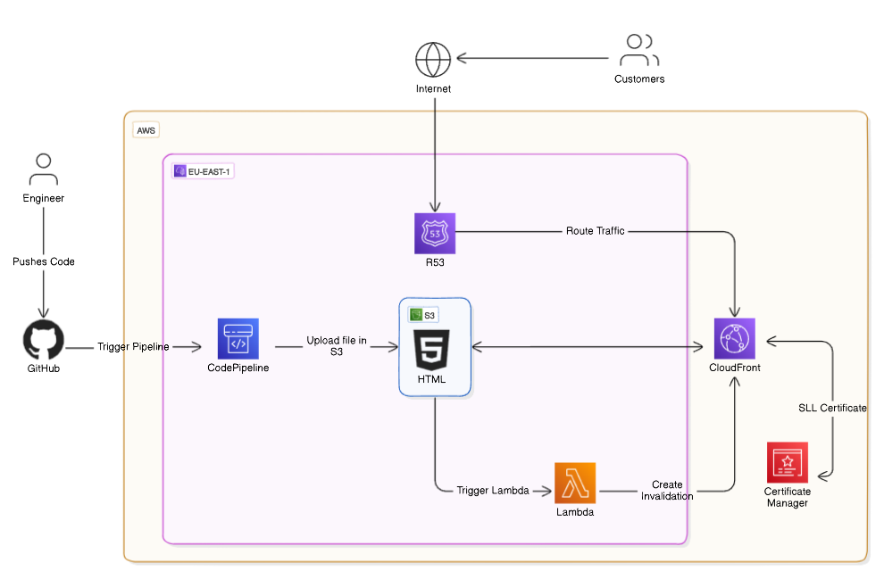

# Project 4 - CICD for Website

# Automated Static Website Deployment with GitHub, S3, CodePipeline, and Lambda

# !!! For the tutorial, check the "Guide" !!!

## Welcome to our automated static website deployment project! Leveraging the power of GitHub, S3, CodePipeline, and Lambda, we've streamlined the process of deploying and updating static websites with ease.

## In this project, we've created a seamless workflow where changes pushed to a GitHub repository trigger an automated deployment pipeline. CodePipeline orchestrates the process, fetching the latest code from GitHub, packaging it, and deploying it to an S3 bucket configured to host the static website.

## But we didn't stop there. To ensure efficient content delivery, we've incorporated a Lambda function to automate CloudFront invalidations. This means that whenever changes are deployed, CloudFront cache is invalidated automatically, ensuring visitors always receive the latest version of the website.

## With this automated setup, gone are the days of manual deployments and cache invalidations. Now, you can focus on developing your website, knowing that updates will be deployed swiftly and reliably, keeping your content fresh and accessible to your audience.

## Join us in embracing automation and simplifying the deployment process for your static websites with GitHub, S3, CodePipeline, and Lambda.

