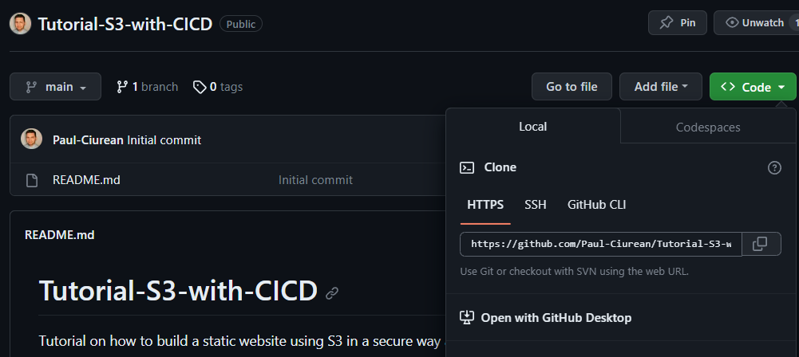
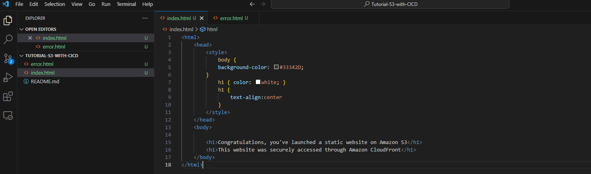
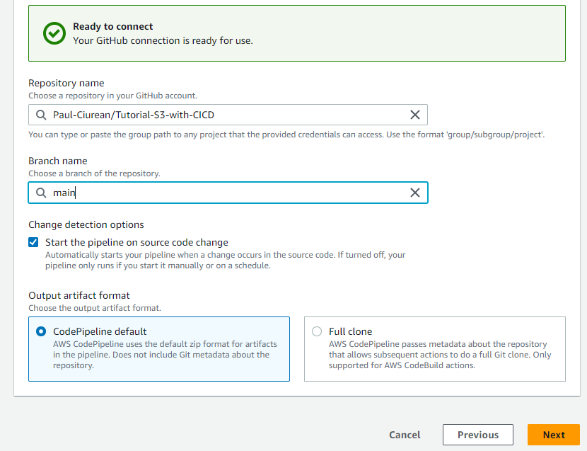
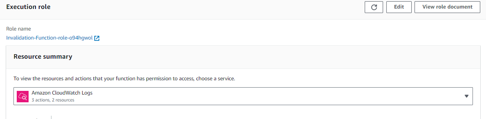

# **Static Website hosted on S3 with CI/CD**

### (step-by-step guide)

## **Introduction:**

### This tutorial will guide you through the process of hosting a static website on Amazon S3 and making it accessible worldwide using Amazon CloudFront. You'll also learn how to secure your website using OAC to keep the bucket private, AWS Certificate Manager to protect and secure your website, and manage your domain with Amazon Route 53. Last but not least, we will use GitHub and AWS CodePipeline to automate every change we want to make to our website.

### Static websites are a cost-effective and straightforward way to establish an online presence, whether it's for personal use, a blog, or a business. By following the steps in this guide, you can quickly host and manage your own static website with AWS's robust cloud services. This setup ensures speed, security, reliability, along with a custom domain and HTTPS support.  

### Here is an architecture on what you will be able to build by the end of this tutorial:  


## **Prerequisites:**

- **AWS Account:** To follow the examples and implement the project, you will need an AWS account.  
- **AWS Services:** While detailed knowledge of AWS services is not required, having a general awareness of services like Amazon S3, Amazon CloudFront, AWS CodePipeline, Lambda, AWS Identity and Access Management (IAM), AWS Certificate Manager, and Amazon Route 53 will be helpful. This tutorial will guide you through the setup and usage of these services. 
- **GitHub Account:** You should have a GitHub account for version control and collaborative development. Basic knowledge of Git for version control is a plus but not strictly required, as this tutorial may provide some Git basics. 
- **Visual Studio Code:** Familiarity with Visual Studio Code (VS Code) is recommended, including how to open, edit, and save files using this code editor. 
- **Web Development Basics (Optional):** Some experience with web development technologies (HTML, CSS, JavaScript) is helpful but not mandatory, as this tutorial will primarily focus on the AWS and DevOps aspects. 

## **Audience:**

### This tutorial is designed to accommodate a broad range of users, from beginners to advanced AWS practitioners. Whether you're new to AWS services or an experienced cloud engineer, you'll find valuable information and guidance tailored to your level of expertise. 

- **Beginners:** If you're just starting your AWS journey, this tutorial will provide step-by-step instructions and explanations to help you grasp the fundamentals and build a strong foundation in cloud static hosting. 

- **Intermediate Users:** If you have some experience with AWS but want to expand your knowledge and enhance your skills, you'll find in-depth insights, best practices, and tips for optimizing your projects. 

- **Advanced Users:** For experienced AWS professionals, this tutorial offers advanced configurations, automation strategies, and techniques to streamline your workflow and achieve a higher level of efficiency in deploying static websites. 

### No matter where you fall on the spectrum of AWS expertise, this tutorial is designed to empower you with the knowledge and tools necessary to successfully host static websites and implement CI/CD pipelines in AWS.

## **!!! All the codes and files that you need you can find them in the Resources  folder. !!!**

## **Step 1:** Create our buckets 

1. Sign in to the AWS Management Console and open the Amazon S3 console at https://console.aws.amazon.com/s3/. 

2. Choose Create bucket. 

3. Enter the Bucket name for example, example.com.(main bucket) 

4. Choose the Region where you want to create the bucket. Choose a Region that is geographically close to you to minimize latency and costs, or to address regulatory requirements. The Region that you choose determines your Amazon S3 website endpoint. For more information, see Website endpoints. 

5. To accept the default settings and create the bucket, choose Create. 

6. Follow the above steps to create a 2nd bucket with the name www.example.com


### We will keep our buckets private, as we will use Origin Access Control(OAC) to restrict users to access our buckets only through Cloud Front distribution. 

### To make sure that the users will be redirected to the main bucket, we will have to enable static website on our 2nd bucket.  

1. We do that by going into our 2nd bucket, we chose Properties, and scroll all the way down to the bottom of the page. 

2. We click Edit and Enable for Static website hosting. 

3. On the section Hosting type we chose Redirect request for an object and on the Host name  we specify our main bucket.  

4. On Protocol we select HTTPS.  

5. Save changes. 

### Your page should look like this:


## **Uploading Website files:**  

### You should upload your Website files in the main bucket(paulciurean.com). For the Static Website you should have an **index.html** file and **error.html** (optional) file. In my index.html.


### In my **index.html** I’ve got a basic webpage created in HTML.  

## **Step 2:** Set up Cloud Front Distribution 
1. In Cloud Front on Distribution page we Create Distribution. 

2. On the Origin page for Origin domain  we select our main S3 bucket. 

3. We give a Name to our origin. 

4. Origin Access we chose Origin access control settings. 

5. Origin access control  we create a control setting. 
- In the new window we give a Name. 
- Origin type we select S3. 
- We keep the default option for the rest. 

6. On the page Default cache behaviour at the section Viewer protocol policy we select Redirect HTTP to HTTPS. We keep the default option for the rest. 

7. Web Application Firewall: We Do not enable security protection. 

8. Settings page:  
- Alternate domain name -> Add item: add the custom domain names. (paulciurean.com and www.paulciurean.com) 
- Custom SSL certificate: we request a certificate. 
- Default root object: index.html (name of our index file). 

9. Create distribution. 

### When popped with the following message: 


### Copy the policy, we will have to complete our distribution configuration by allowing read access to CloudFront OAC in our S3 bucket policy statement. 

### To do that follow the next steps:  
1. Go to our main bucket. 
2. In Permissions scroll down to Bucket policy and click Edit. 
3. Paste the policy you copied from the CloudFront distribution. 


### **PS: If you did not copy the policy after creating the distribution, you can find it in CloudFront -> Distribution -> Origins -> select Origins name and click Edit. On the following page you can find the policy.**

### To test if our website is working, you can copy the Distribution domain name from your distribution: 


### And paste it in a new browser. My page looks like this: 


### **PS: If it doesn’t work that means the CloudFront distribution is not deployed yet. Give it few minutes and refresh the page.**

## **Step 3:** Domain and DNS Configuration 

### **Register a Domain** (if you don’t already have one). 

### **Set up DNS Records:**  

1. In Route 53 on the Hosted zone page, Create **hosted zone**. 

2. Select the name of your website **(paulciurean.com)**. 

3. Type: **Public hosted zone**. 

4. Create hosted zone. 

### By default there will be 2 record names.  
### We now create 2 other records: 1 for paulciurean.com and 1 for www.paulciurean.com 

5. Click Create record. 

6. Click on Switch to quick create.  

7. Record name: leave it blank. (when you create 2nd record you will have to type **www**).

8. For Record type chose **A**. 

9. Above Value click **Alias**. 

10.  Route traffic to: **Alias** to **CloudFront distribution**. 

11.  Chose your distribution created in Step 2. 

12.  Click Create records. 

13.  Follow the previous steps to create a record for **“www”**. 

### You are now ready to test the website by opening a browser and browse the following URLs:  http://your-domain-name, for example, example.com – Displays the index document in the your-domain-name bucket http://www.your-domain-name for example, www.example.com – Redirects your request to the your-domain-name bucket 

### **PS: If it doesn’t work that’s because usually DNS changes will propagate within a few hours, but it can take up to 48 hours for everything to propagate across the Internet.**

## **So far we achieved the following :** 


### Up to this point, this is in detail tutorial on how to set up a static website using S3, keep the bucket private and secure using OAC, make it accessible worldwide using CloudFront for low latency, secure and protect your website with Certificate Manager, and manage your domain with Amazon Route 53. 

### If we want to make any changes to our website, we have to change the files (**index.html** and others such as **style.css** and **script.js** in case we want to add style to our website, not just keep it a blank page), delete and upload the files again in S3 manually, go to CloudFront and create an invalidation to remove the cache so the users can see the up-to-date site.  

## **Up next we will continue building a CI/CD pipeline to automate the process of making any changes to our website.**

## **Step 4:** Using Visual Studio Code and Github 

### You should have a basic understanding on how to use VSC and github for the following part.  

### Here is a list of videos I watched to set up and get used to VSC and github: 

[Click here to learn how to set up Git in VSC](https://www.youtube.com/watch?v=i_23KUAEtUM) 

[Click here to learn how to use Git and GitHub](https://www.youtube.com/watch?v=RGOj5yH7evk&t=1475s) 

1. Open your GitHub account and create a new repository.


2. Once the repository is created open VSC and press **Shift+CTRL+P**

3. Copy the link from **Local -> HTTPS** in your clipboard. 



4. Type **clone** to clone the repository 


5. Paste the link from Github website in the section above. That will take you to a window where you will have to select a folder where to keep your files locally on your machine. 

**PS: This will only work after you connect the github account with your local machine. Follow the tutorials from the youtube videos from above.**

6. You should now be in VSC with the repository open looking like this:  


### Here is the place where you can create your **index.html**, **styles.css**, and all the rest of the files for your website. In my repository you will be able to find the files I am using for this tutorial. 



### To commit the changes to the github repo into your online github account follow the next steps: 

1. Click on source control on the left side of the page: 


2. Stage all changes. Press on + button: 


3. Type a message and press Commit. 


4. Press **Sync Changes** and **OK** to commit the changes. 


### Now if you go online into your github account, you will find the 2 new files added to your repository. 


### **Well done! We created our repository online where we will store our website files and this is where we will connect our pipeline to make the changes to our website easier.** 

## **Step 5:** CI/CD Pipeline with AWS CodePipeline 

- **Create the Pipeline:** 


- **Add source stage:**


-  **Create a connection:** 


- **Connect to GitHub:** 


- **Install a new app:**  




## **We can skip the building page as we build our files in VSC.** 

- **Add deploy stage:**


- **Review the pipeline:**  


### AWS test the pipeline and we receive a **SUCCESS**.


## CodePipeline is now pulling any changes from GitHub and deploying them to the bucket that the website is hosted in. Looking at the S3 bucket you can see all the files have been updated at the same time. This is because CodePipeline deploys the entire repository rather than just individual changed files.


## **Step 6:** Create the Lambda Function 

- **Create Function:**


- **Copy the python code in lambda function**

```

import json
import boto3
s3_client = boto3.client('s3')
cloudfront_client = boto3.client('cloudfront')
def lambda_handler(event, context):
 	for record in event['Records']:
 		if record['s3']['object']['key'] == "index.html":
 			invalidation = cloudfront_client.create_invalidation(
				 DistributionId = "Your-distribution-ID",
				 InvalidationBatch ={
				 	'Paths': {
 						"Quantity": 1,
 						"Items": ["/*"]
 					},
					"CallerReference": str(record['eventTime'])
 				}
	 		)
 			return {
 				'statusCode': 200,
 				'body': json.dumps("Cloudfront invalidation successfully created")
 			}
 	return{
 		'statusCode': 204,
 		'body': json.dumps("No file called index.html therefore no invalidation created")
}

```

## **Make sure to change the CloudFront Distribution ID in the code on line 9**.

- **Add permissions to Lambda to be able to create invalidation**.

- **In Lambda go to Configuration -> Permission**



- **Add permissions**


- **Create a new  inline policy. You can find the JSON for it in GitHub**

```

{
    "Version": "2012-10-17",
    "Statement": [
        {
            "Sid": "AllowDistributionInvalidation",
            "Effect": "Allow",
            "Action": "cloudfront:CreateInvalidation",
            "Resource": "YOURCLOUDFRONTARN"
        }
    ]
}

```

## **Make sure to change the name of the CF distribution on line 8**

- **Create a test event**


## **Make sure you change the following:**  

- **Line 10 - replace “example” with your account number** 
- **Line 25 - replace “example” with your account number** 
- **Line 27 – replace “example-bucket” with your bucket name**

```

{
  "Records": [
    {
      "eventVersion": "2.0",
      "eventSource": "aws:s3",
      "awsRegion": "us-east-1",
      "eventTime": "1970-01-01T00:00:00.000Z",
      "eventName": "ObjectCreated:Put",
      "userIdentity": {
        "principalId": "your-account-id"
      },
      "requestParameters": {
        "sourceIPAddress": "127.0.0.1"
      },
      "responseElements": {
        "x-amz-request-id": "EXAMPLE123456789",
        "x-amz-id-2": "EXAMPLE123/5678abcdefghijklambdaisawesome/mnopqrstuvwxyzABCDEFGH"
      },
      "s3": {
        "s3SchemaVersion": "1.0",
        "configurationId": "testConfigRule",
        "bucket": {
          "name": "demo1910.com",
          "ownerIdentity": {
            "principalId": "your-account-id"
          },
          "arn": "arn:aws:s3:::Example-bucket"
        },
        "object": {
          "key": "test%2Fkey",
          "size": 1024,
          "eTag": "0123456789abcdef0123456789abcdef",
          "sequencer": "0A1B2C3D4E5F678901"
        }
      }
    }
  ]
}

```

- **Test the function** 


- **Trigger lambda with S3 events**


## **To make sure the invalidation is triggered only when you change the .html file we add the following to SUFFIX** 


## **Final test** 

### I changed the code in index.html file and the lambda created the invalidation successfully:


## **The website was updated within seconds:** 


## **7. Conclusion**

### In this tutorial, we've seen how you can keep your data safe. S3 buckets, which store your website files, should never be left open to the public (unless we are required to do so) because there are always people looking for exposed data. We can protect them using methods like Origin Access Control and by making sure services don't need to go over the public internet to access these files. 

### We've also learned about a handy way to update your website automatically. This is done using AWS CodePipeline, but there are other services like AWS CodeCommit (in our case GitHub) and AWS CodeDeploy that help you manage your code and deploy it to different parts of AWS. 

### Lastly, we explored an easy way to automate tasks by using AWS Lambda. This keeps your website up to date without having to manually make changes to CloudFront. 

### So, in simple terms, our setup emphasizes the need for safety, easy updates, and automation in your AWS projects. These practices will make your system more secure, efficient, and reliable. 

# Thank you for following this tutorial. In case you need any help or guidance don’t hesitate to contact me. **[www.paulciurean.com](https://paulciurean.com)**  