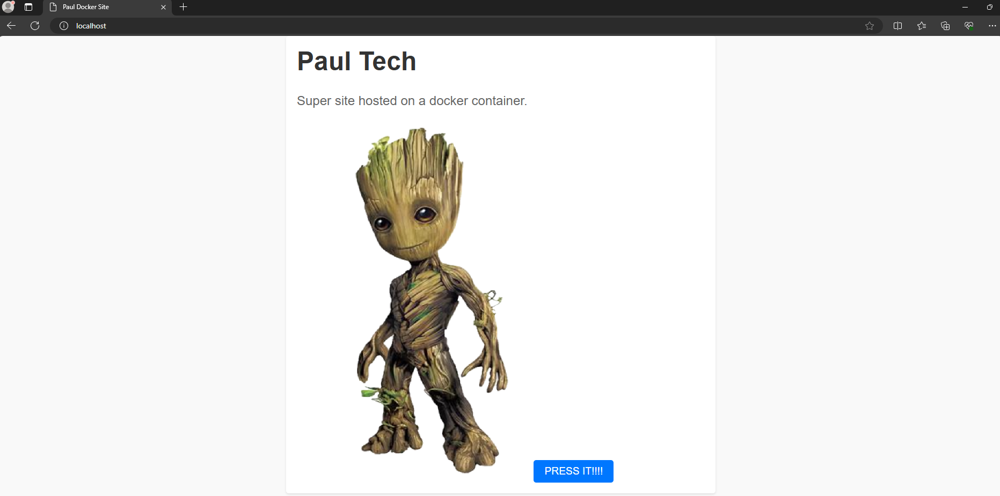

# Deploy a Website using Docker

### In this project I will deploy a website on the localhost using a docker image from my docker repo, then I will modify the image and redeploy the website. 
### Once I have the new image, I will create an AWS ECR (Elastic Container Registry), I will push the image to the ECR and deploy it using Fargate for wordwide access.

## Part 1: Deploy the super website:

### 1. I opened command prompt and ran `WSL` (I'm on a windows machine, if you have Linux or MacOS you don't have to do this) so I can run any Linux commands in the terminal.
### TIP: I recommend to use `export PROMPT_DIRTRIM=1` to make a shorter path so it will go from `/mnt/c/Users/paul_/OneDrive/Desktop/docker-test` to `/docker-test`


### 2. With the following commands I will check if I have any docker images or docker containers:

`docker images` `docker ps -a`


### 3. Using the command `docker search <image>` I am looking for my image in Docker Hub.


### 4. I use `docker pull paulciurean/paul_tech:1.0` to pull the image from Docker Hub on my local machine.


### 5. I check to see if I've got the image with `docker images` and run a container using that image. To do that I use `docker run -d --name paul_website -p 80:80 paulciurean/paul_tech:1.0`


### 6. Open a new browser and run `localhost:80` to see the Super Website.
### Note: If you want to create another container, you need to give it a different port range(e.g: 81:80) because you can not have 2 containers running on the same port.



### You can stop here and play around with the above commands, try to create different websites or you can follow the guide til the end. 

## Part 2: Modify the existing website:

### 1. Connect to the container using `docker exec -it <name> /bin/bash`. I'll check what files we have here and what I want to change.
### Note: You can use either Container ID or the name of the container here. In the image below you will see me using the Container ID


### 2. Exit the container with `exit` command, and copy the new picture for the new website. We do this by using `docker cp <new picture> <website-name>:/app/`
### I connect back to the container and check if I have the new picture where it has to be.


### 3. I ran into a problem, when trying to open `index.html` I can't because I don't have `VIM` installed on this container. To install it run `apt-get install vim`


### 4. I open the file `index.html` to modify the website.


### 5. I then create the image by using `docker commit <your-website> <your-repo:new-tag>` 
### You can check if you created the new docker images correctly.


### 6. In case your image doesn't have a name, you can use `docker tag` to change the name and tag for it, and with `docker push <new-image>` you can push it to the Docker Hub repo. 


### 7. Time to launch the new website :D 
`docker run -d --name learning_website -p 81:80 paulciurean/paul_tech:1.2`


### 8. Open a new browser and run `localhost:81` to see the new website.


### 9. You can check that you have 2 different websites on 2 containers.


## Part 3: Now let's deploy it in AWS:

### 1. First we create a repo in ECR:
### PS: Ignore the `Unknown output type: JSON`, if you want to make sure the command did work, you can log into your AWS account and check ECR repos.
### PSS: Make sure you use your own `account-id`, `alb-arn`, `target-group-arn` and any other variables which are unique.

`aws ecr create-repository --repository-name paul_tech --region us-east-1`


### 2. Authenticate Docker to the Amazon ECR registry:

`aws ecr get-login-password --region us-east-1 | docker login --username AWS --password-stdin <account-id>.dkr.ecr.us-east-1.amazonaws.com`


### 3. I will have to tag my docker image: 

`docker tag paulciurean/paul_tech:1.2 <account-id>.dkr.ecr.us-east-1.amazonaws.com/paul_tech:1.2`

### 4. Push the docker image to ECR repo:

`docker push <account-id>.dkr.ecr.us-east-1.amazonaws.com/paul_tech:1.2`


### 5. Create the ECS cluster: 

`aws ecs create-cluster --cluster-name my-cluster --region us-east-1`


### 6. Create a task definition:

`vim task-definition.json`

```
{
  "family": "my-task",
  "networkMode": "awsvpc",
  "containerDefinitions": [
    {
      "name": "my-container",
      "image": "<account-id>.dkr.ecr.us-east-1.amazonaws.com/paul_tech:1.2",
      "essential": true,
      "portMappings": [
        {
          "containerPort": 80,
          "hostPort": 80,
          "protocol": "tcp"
        }
      ]
    }
  ],
  "requiresCompatibilities": ["FARGATE"],
  "cpu": "256",
  "memory": "512",
  "executionRoleArn": "arn:aws:iam::<account-id>:role/ecsTaskExecutionRole",
  "taskRoleArn": "arn:aws:iam::<account-id>:role/ecsTaskExecutionRole"
}

```


### 7. Register the task definition:

`aws ecs register-task-definition --cli-input-json file://task-definition.json --region us-east-1`

### 8. Create a target group for Aplication Load Balancer:

`aws elbv2 create-target-group --name my-target-group --protocol HTTP --port 80 --vpc-id <your-vpc> --target-type ip --region us-east-1`

### 9. Create the Aplication Load Balancer:

`aws elbv2 create-load-balancer --name my-alb --subnets <subnet-1> <subnet-2> --security-groups <security-groups> --region us-east-1`

### 10. Create the ALB listener:

`aws elbv2 create-listener --load-balancer-arn <alb-arn> --protocol HTTP --port 80 --default-actions Type=forward,TargetGroupArn=<target-group-arn> --region us-east-1 `

### 11. Create an ECS Service with the Load Balancer:

```
aws ecs create-service --cluster my-cluster --service-name my-service --task-definition my-task --desired-count 1 --launch-type FARGATE --network-configuration "awsvpcConfiguration={subnets=[<subnet-1>,<subnet-2>],securityGroups=[sg-089ba5e2081a09926],assignPublicIp=ENABLED}" --load-balancers '[{"targetGroupArn":"<target-group-id>","containerName":"my-container","containerPort":80}]' --region us-east-1
```


### You can stop here if you don't have a domain name. You can get the ALB DNS name and run it in a new browser, it will display the new website ran on ECS, which is accessible by everyone on internet.

### PS: You might have to wait few minutes for the ECS service to be created.

## Part 4: Attach a Domain Name to ALB:

### 1. I will create a Route53 hosted zone:


```
{
  "Comment": "Creating Alias resource record sets in Route 53",
  "Changes": [
    {
      "Action": "UPSERT",
      "ResourceRecordSet": {
        "Name": "<your-domain-name>",
        "Type": "A",
        "AliasTarget": {
          "HostedZoneId": "Z35SXDOTRQ7X7K",  // Hosted zone ID for ALB in us-east-1
          "DNSName": "<your-alb>",
          "EvaluateTargetHealth": false
        }
      }
    },
    {
      "Action": "UPSERT",
      "ResourceRecordSet": {
        "Name": "www.<your-domain-name>",
        "Type": "A",
        "AliasTarget": {
          "HostedZoneId": "Z35SXDOTRQ7X7K",  // Hosted zone ID for ALB in us-east-1
          "DNSName": "<your-alb>",
          "EvaluateTargetHealth": false
        }
      }
    }
  ]
}

```

### PS: Don't change the HostedZoneID because that's the one for `us-east-1`, if you want to create a hosted zone in another region, make sure to check the AWS docs for the HostedZoneID

### 2. Update the Route53 record:
`aws route53 change-resource-record-sets --hosted-zone-id <your-hosted-zone> --change-batch file://change-batch.json`


## Now you can access your domain name (e.g.: digitalcloudadvisor.info) and you have full access to your website.


## You've reached the end of tutorial, if you want to discuss with me about this project, message me on [LinkedIn](https://www.linkedin.com/in/ciprian-paul-ciurean-80386424b/)

## Hope you enjoyed it.

# THE END